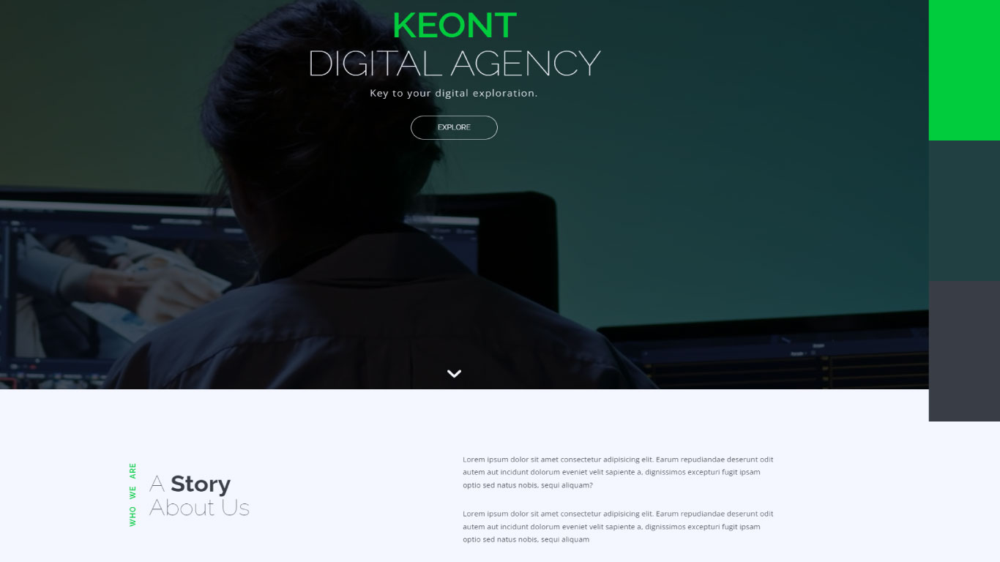

# DIGITAL MARKETING AGENCY WEBSITE DESIGN

## Description

This project is a website template aimed for digital marketing agency.

## Table Of Content

- [Overview](#overview)
- [Technologies](#technologies)
- [Installation](#installation)
- [Usage](#usage)
- [License](#license)
- [Questions](#questions)

## Overview

Stactic website has potential to bring backend technology to be fully functional web application.

## Technologies

- HTML
- CSS3
- JAVASCRIPT
- jQUERY
- boostrap
- jquery plugins: owl corousel , Resposive tabs.

## License

 
This repository is licensed under the MIT license.

## Questions

For any questions,please contact [lohith05amal@gmail.com](mailto:lohith05amal@gmail.com). View all my works [AmalLohith](https://github.com/LohithAmal)

[LIVE LINKS](https://lohithamal.github.io/KEONT-DIGITALS/)
